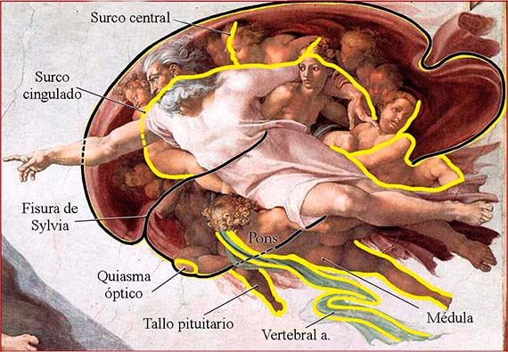
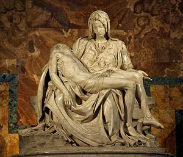
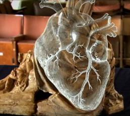
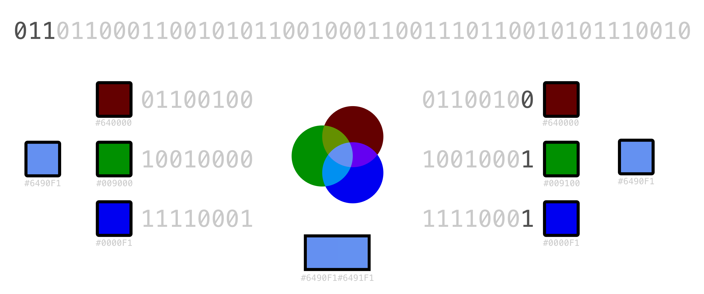
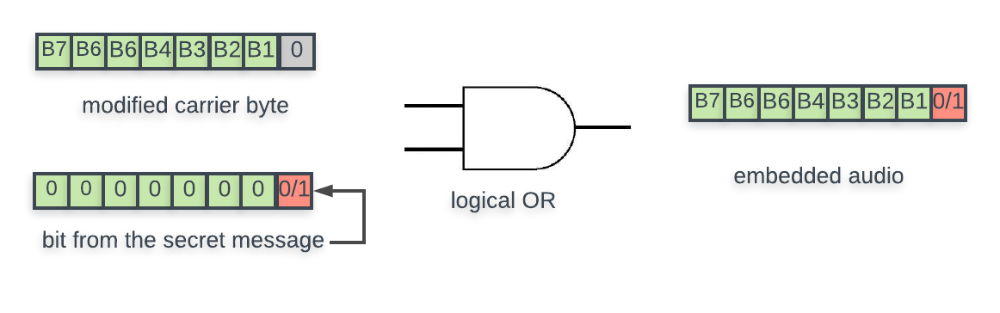
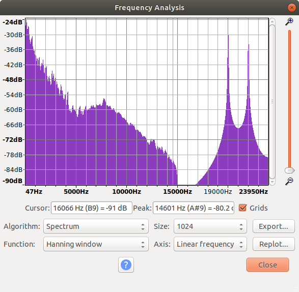
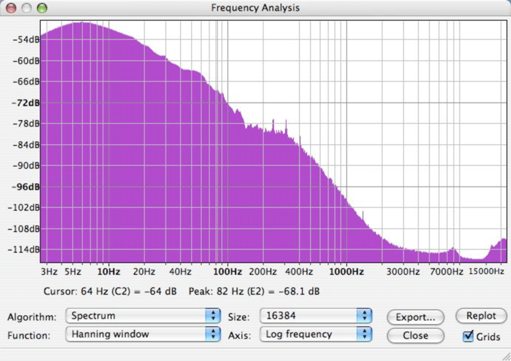

# Introducción

Del griego *steganos* (oculto) y *graphos* (escritura), la esteganografía es la disciplina que trata el uso de técnicas que permiten la ocultación de mensajes u objetos dentro de otros que hacen de portador, con el objetivo de que su transmisión no sea perceptible.

Es decir, estudia establecer canales encubiertos de comunicación mediante objetos portadores de mensajes ocultos para que pasen inadvertidos a ojos de otros usuarios del canal, en caso de que éste sea público o compartido.

Aunque esta disciplina esté relacionada directamente con la criptografía, ya que ambas tienen como objetivo el desarrollo de procesos que permitan la protección de la información, la forma de implementar los mecanismos de protección son diferentes.

La criptografía aplica funciones de cifrado a la información para hacerla ininteligible de cara a un atacante y éste conoce la existencia del mensaje que está siendo transmitido. Por otro lado, la esteganografía oculta la información de modo que su existencia y, sobretodo, su transmisión no sea advertida.

El uso complementario de ambas disciplinas nos proporciona un mecanismo ideal para la protección de la información, dando un nivel de seguridad mejorado. Esto es cifrando el mensaje a ocultar antes de ser esteganografiado. De este modo, un atacante que descubriese la técnica estaganográfica no obtendría la información tansmitida en plano, sino que la encontraría cifrada.

En este documento se hablará de algunas técnicas de esteganografía digital y se presentarán herramientas que nos permiten ocultar mensajes en medios digitales como imágenes y audios. Además se documentará una prueba de concepto con la que se intenta ilustrar el funcionamiento y uso de la esteganografía.

# Anécdotas históricas

Por norma general, cuando hablamos de esteganografía nos referimos a la
esteganografía digital. No obstante, no debemos olvidar que la esteganografía se
usa desde hace muchos siglos.

El primer registro que tenemos consta del año 440 a.C, donde ya se realizaban
aplicaciones esteganográficas rapando la cabeza de una persona, tatuando un
mensaje en su cabellera, enviarlo cuando el pelo ya le había crecido y que el
receptor le vuelva a rapar cuando quisiera leer el mensaje.

Un ejemplo de estas técnicas digno de mencionar es el de Miguel Ángel, el
arquitecto, escultor y pintor italiano. Es sabido que tenía especial interés por
la anatomía. De hecho, una parte de su vida la dedicó a la disección de
cadáveres para su estudio. Diversas teorías afirman que dejaba constancia de sus
estudios en sus obras más importantes, como por ejemplo en *la bóveda de la
Capilla Sixtina*.

En ella se encuantra probablemente su obra más conocida, *La creación de Adán*.
Figura 1.

Tras su estudio, el médico estadounidense Frank Lynn Meshberger notó que el
manto que recubre la representación de Dios concuerda con la silueta de un
cerebro. Figura 2.

No solo en pintura, también se dice que Miguel Ángel ocultó sus avanzados
conocimientos anatómicos en sus esculturas. En su obra *La Piedad* hay quien
dice que, visto desde atrás, el manto dibuja la forma de un corazón humano.
Figura 2 y 3.

Al final, lo bonito de la esteganografía es que solo el autor/emisor puede
afirmar si efectivamente quiso mandar cierto mensaje oculto o nosotros, cientos
de años después, queremos ver ese mensaje y nos autosugestionamos.

En la antigüedad por tanto, como es obvio, se hacía uso de la esteganografía
física. Con la llegada de los ordenadores, esconder información resulta más
sencillo pero también las técnicas para detectarlo son más potentes. Por
ejemplo, una persona que supiera lo que esta viendo, podría llegar a ver a
simple vista el ejemplo del cerebro mencionado anteriormente. No obstante, es
muy dificil cuando trabajamos a nivel de píxeles o frecuencias como veremos a
continuación.

# Imágenes

En este apartado veremos cómo se aplica la esteganografía a las imágenes. Uno de
los métodos más comúnes es mediante LSB (Least Significant Bit).

## LSB 

La idea es muy sencilla. Por norma general, para representar una imagen, cada píxel se
representa por una tupla (R,G,B). Cada componente R, G, B puede tomar valores
desde el 0 al 255, o lo que es lo mismo, cada componente se representa con 8
bits. Si tenemos por ejemplo el número 145 (*0b10010001*), si cambiamos el primer
bit y lo dejamos como *0b00010001*, sería 17. El número cambia muchísimo. Esto es porque
el primer bit es el bit más significativo. No obstante si en lugar de cambiar el
primer bit cambiamos el último, *0b10010000* sería 144. La diferencia entre un número y
otro es mínima. Esto es porque el último bit es el menos significativo. El ojo
es incapaz de percibir esta diferencia cuando hablamos de colores.

Sabiendo esto, podemos hacer lo siguiente. Una imagen está formada por x píxeles.
Cada pixel tiene 3 componentes, y si utilizamos el último bit para almacenar
información oculta, significa que en cada pixel tenemos 3 bits donde podemos ir
escribiendo nuestro mensaje. Figura 5.

Por tanto, en la imagen de x píxeles, podremos guardar un total de 3\*x bits de
información. Por ejemplo, en una imagen de *1920x1080*, tendríamos 2073600
píxeles, o lo que es lo mismo, 6220800 bits. Esto significa que si
almacenaramos un texto plano en ASCII donde un caracter son 8 bits, podríamos
enviar un mensaje de hasta 777600 caracteres.

## Almacenando la información

Una vez que sabemos como almacenar información en una imagen, debemos estudiar
de qué manera hacerlo. Vamos a suponer que almacenamos cierto mensaje para el
cual necesitamos 24 bits. En principio nos bastaría con 8 píxeles para almacenar
nuestra información oculta pero, ¿qué píxeles elegimos? A uno se le podría
ocurrir elegir los ocho primeros, pero un atacante que pudiera tener una idea
de que cierta imagen contiene información oculta, es lo primero que haría. Por
eso, lo óptimo sería elegir los píxeles portadores de manera "aleatoria"
teniendo en cuenta que el receptor debe ser capaz luego de saber cuales son. Más
adelante veremos como lo hacen herramientas como *steghide*.

Otra cosa a tener en cuenta es ya no tanto en qué píxeles almacenamos el
mensaje, sino cómo almacenamos el mensaje en sí. Es decir, si un atacante conoce
el método con el cual elegimos los píxeles donde almacenamos nuestro mensaje
oculto, estaremos comprometidos. No obstante, podemos añadir un nivel de
complejidad si almacenamos nuestro mensaje cifrado. De esta manera, no solo
tendremos un canal oculto de comunicación sino que el mensaje que se envía por
el canal tampoco puede ser leído por cualquiera (a no ser que conozca la clave o
rompa nuestro cifrado, lo cual si usamos métodos ya estudiados es poco
probable). Para cifrar nuestro mensaje podemos utilizar cifrados simétricos o
asimétricos (este último sería lo más óptimo para asegurarnos que, aunque el
método esteganográfico hubiera sido comprometido desde la primera comunicación,
nadie puede obtener algo legible de la misma).

# Audios

Igual que podemos almacenar información en una imagen, también es posible
hacerlo en una pista de audio.

## LSB

La idea aquí sería exactamente la misma que con las imágenes, almacenar nuestro
mensaje en los bits menos significativos. En contraposición a los pixeles, en
las pistas de audio tendríamos tramas. Deberíamos de ir almacenando, en cada
byte de las tramas de audio que forman la pista completa, nuestro mensaje poco a
poco. Figura 6.

El problema de este método es que, a diferencia de en una imagen, con un buen
equipo de sonido puedes notar el pequeño ruido que deja el modificar los bits. 

## Modulación de frecuencia

Este método, en contraposición al otro, es imperceptible por el oído humano. Nos
aprovecharemos de las frecuencias para almacenar información donde el oído
humano no llega.

La idea es la siguiente. Un oído sano y joven es sensible a las frecuencias
comprendidas entre los 19Hz y los 19kHz. Fuera de este espectro tendríamos por
debajo los infrasonidos, que son ondas acústicas inferiores a los 20Hz, y por
encima los ultrasonidos, que son ondas acústicas de frecuencias superiores a los
20kHz. Los infrasonidos siguen siendo perceptibles a través del tacto, pero los
ultrasonidos, si conseguimos ponerlo a una frecuencia lo suficientemente alta,
podemos hace que sea imperceptible.

Como podemos en la Figura 7, hay un par de picos a la derecha del todo, es
decir, en la frecuencia más alta. Hemos dicho anteriormente que el oído humano
no percibe frecuencias más altas de 19kHz, por lo que puede resultarnos raro
que haya información hasta los 24kHz. Para compararlo, en la Figura 8 tendríamos un
análisis de frecuencia realizado a una pista de audio normal.

# Herramientas
## Steghide

Steghide es un programa de esteganografía que nos permite ocultar información en diferentes formatos de imagen y audio. Este software incluye funcionalidades como la compresión de la información y su cifrado previo a la ocultación en el medio elegido, además de una posterior comprobación de integridad mediante un checksum.

Los formatos de archivo portador permitidos son JPEG, BMP, WAV y AU, además no existe ningún tipo de restricción sobre el formato del archivo a ocultar. Aunque no exista ninguna restricción, es importante tener en cuenta algunos aspectos para que el objeto portador sea lo más discreto posible. Nos referimos, en primer lugar, al tamaño del objeto portador ya que cuanto más grande sea, más "espacio" habrá para esconder la información y que pase desapercibida. En segundo lugar, el tamaño de la información a ocultar debe ser significativamente menor al del objeto portador para evitar que el objeto original sea modificado en exceso.

El proceso implementado por Steghide para ocultar la información consiste, en primer lugar, en comprimir y cifrar la información. Después se seleccionan una serie de píxeles, en caso de usar una imagen como medio portador, basados en un generador de números pseudoaleatorios inicializado con la contraseña indicada. La información se ocultará en estos píxeles, omitiendo aquellos que contengan valores correctos, se encuentran pares de píxeles tales que al intercambiarlos obtengamos el que sería el resultado de incrustar la información deseada y por último, se modifican aquellos que no han encontrado un par de acuerdo a la información a ocultar.

Al intercambiar píxeles en lugar de modificarlos consigue minimizar la alteración que aplicamos a la imagen evitando modificar algunos parámetros como el número de veces que aparece un color en la imagen o algún otro dato estadístico por el estilo, dificultando así un posible análisis por parte de un atacante.

El algoritmo de cifrado uso por defecto es Rijndael (AES) con una clave de 128 bits en modo *cipher block chaining*, aunque acepta el uso de otros algoritmos con diferentes modos de operación como RC4, DES, Blowfish, 3DES o incluso la versión de tamaño de clave de 256 bits de AES entre otros. El algoritmo usado para realizar la comprobación de integridad es CRC32.

# Rompecabezas

Como hemos visto, el campo de la esteganografía al final te deja posibilidades
infinitas para almacenar información de manera que imperceptible. Esto ha dado
lugar a que mentes creativas de todo el mundo hagan sus propios puzzles para que
el resto lo resuelva.

En Internet hay competiciones llamadas comunmente como CTF (*Capture the flag* o
*Caputura la bandera*). Consiste en resolver un puzzle el cual suele estar muy
relacionado con la seguridad informática. Unas de las categorías es la de
esteganografía (o "stego" de *steganography* en inglés). Este apartado lo
usaremos para ver un pequeño ejemplo de como podemos almacenar información
oculta de manera creativa.

En cierta plataforma de retos nos daban la imagen que podemos ver en la figura
9. Puede parecer un mosaico y nada más, lago más bien artístico, pero esconde un
mensaje.

El autor de este método hizo lo siguiente. Podemos diferenciar 2 tipos de
píxeles. Por un lado tenemos píxeles con colores significativos y píxeles
negros. De hecho, si utilizamos alguna herramienta con la que podamos tomar los
valores RGB de un píxel, veremos que por ejemplo el primer pixel, el (0,0),
sería (100, 75.3, 0), el segundo pixel (0, 100, 75.3)... Todos los píxeles
significativos tienen en RGB el valor 100, 75.3 o 0, o lo que es lo mismo, solo
hay 3 símbolos posibles (base 3). Como cada píxel tiene 3 componentes, cada
píxel puede almacenar 27 valores diferentes. Además, si nos fijamos en la
imagen, los píxeles negros hacen una especie de camino en espiral hasta el
centro de la imagen en sentido horario. Podemos hacernos una idea de lo que está
pasando.

Los píxeles negros están actuando simplemente de delimitador. Debemos de ver los
valores de cada pixel siguiendo la forma en espiral de los píxeles
significativos. Cambiaremos el valor 100 por 2 y el valor 75.3 por 1. De esta
manera, el primer píxel seria 210 en base3, el segundo 021... ¿Qué podemos
almacenar si tenemos 27 valores diferentes? El alfabeto. El 000 será la 'a', 001
la 'b', 002 la 'c', 010 la 'd'... Es probable que al terminar acabemos con un
mensaje que no sea legible. Hay entonces dos opciones: está cifrado o nos hemos
equivocado con la conversión. Quizás el autor pensaba que el orden correcto era
de dentro hacia fuera, o en vez de cambiar los valores como nosotros, ha
cambiado el 0 por 2, el 75.3 por 1 y el 100 por 0...

Lo importante aquí es que debemos de tener claro que no existen reglas para la
esteganografía, y que cuando alguien inventa un método para esconder información
de manera oculta, intenta que hacerlo de la manera más confusa posible para que
un atacante no pueda obtenerlo fácilmente. 

Hay muchas plataformas y eventos donde podemos participar para practicar estás
tecnicas, que no dejan de ser un rompecabezas.
Queda en manos del lector si quiere mejorar sus técnicas y creatividad para
descubrir cómo se ha almacenado cierta información oculta en una imagen.

# *Proof of Concept* (POC)

Para ilustrar el funcionamiento y uso de la esteganografía hemos desarrollado un sistema de divulgación encubierta de noticias y anuncios a través de Twitter. Disponible en el [repositorio de Github](https://github.com/daraahh/stegoSPSI).

Permite a un usuario emisor transmitir texto a través de un perfil público de Twitter ([\@stegospsi](https://twitter.com/stegospsi/)) y que otros usuarios puedan consultar las novedades ocultas en imágenes como si de un tablón de anuncios se tratase.

Además para facilitar la exposición de esta prueba de concepto, hemos desplegado una aplicación web en Heroku ([disponible aquí](https://stegospsi.herokuapp.com/)) que sencillamente actuará de cliente y mostrará de forma cronológica los textos ocultos en el perfil de Twitter.

En el esquema de la figura 1 se ilustra la arquitectura del sistema y las diferentes partes que lo componen.

El funcionamiento de este sistema se basa principalmente en dos herramientas, la API para desarrolladores proporcionada por Twitter y Steghide.

Cuando el emisor quiere difundir una noticia nueva, usa el script [stegotwitter.py](https://github.com/daraahh/stegoSPSI/blob/master/stegotwitter.py) indicando como argumentos la imagen que se colgará en el perfil de Twitter y el texto a ocultar. Dicho texto será cifrado usando una contraseña por defecto definida por los desarrolladores y posteriormente ocultado utilizando Steghide. Una vez éste ha sido ocultado, se creará un nuevo tweet con la imagen usando la API de twitter y se publicará la imagen.

Por otro lado, el funcionamiento del [frontend](https://github.com/daraahh/stegoSPSI/blob/master/app.py) y los [clientes](https://github.com/daraahh/stegoSPSI/blob/master/client.py) es idéntico, ambos harán una llamada a la API de Twitter para recuperar los tweets del perfil que difunde las imágenes, ejecutarán Steghide y extraerán la información oculta presentándola cronológicamente.

