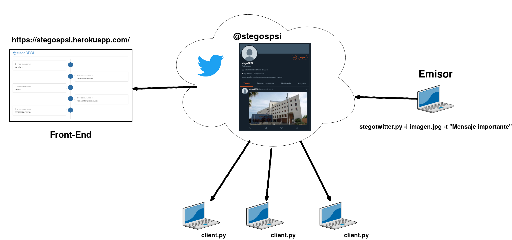

# Introducción

Del griego *steganos* (oculto) y *graphos* (escritura), la esteganografía es la disciplina que trata el uso de técnicas que permiten la ocultación de mensajes u objetos dentro de otros que hacen de portador, con el objetivo de que su transmisión no sea perceptible.

Es decir, estudia establecer canales encubiertos de comunicación mediante objetos portadores de mensajes ocultos para que pasen inadvertidos a ojos de otros usuarios del canal, en caso de que éste sea público o compartido.

Aunque esta disciplina esté relacionada directamente con la criptografía, ya que ambas tienen como objetivo el desarrollo de procesos que permitan la protección de la información, la forma de implementar los mecanismos de protección son diferentes.

La criptografía aplica funciones de cifrado a la información para hacerla ininteligible de cara a un atacante y éste conoce la existencia del mensaje que está siendo transmitido. Por otro lado, la esteganografía oculta la información de modo que su existencia y, sobretodo, su transmisión no sea advertida.

El uso complementario de ambas disciplinas nos proporciona un mecanismo ideal para la protección de la información, dando un nivel de seguridad mejorado. Esto es cifrando el mensaje a ocultar antes de ser esteganografiado. De este modo, un atacante que descubriese la técnica estaganográfica no obtendría la información tansmitida en plano, sino que la encontraría cifrada.

En este documento se hablará de algunas técnicas de esteganografía digital y se presentarán herramientas que nos permiten ocultar mensajes en medios digitales como imágenes y audios. Además se documentará una prueba de concepto con la que se intenta ilustrar el funcionamiento y uso de la esteganografía.

# Anécdotas históricas
# Imágenes
# Audios
# Herramientas
## Steghide

Steghide es un programa de esteganografía que nos permite ocultar información en diferentes formatos de imagen y audio. Este software incluye funcionalidades como la compresión de la información y su cifrado previo a la ocultación en el medio elegido, además de una posterior comprobación de integridad mediante un checksum.

Los formatos de archivo portador permitidos son JPEG, BMP, WAV y AU, además no existe ningún tipo de restricción sobre el formato del archivo a ocultar. Aunque no exista ninguna restricción, es importante tener en cuenta algunos aspectos para que el objeto portador sea lo más discreto posible. Nos referimos, en primer lugar, al tamaño del objeto portador ya que cuanto más grande sea, más "espacio" habrá para esconder la información y que pase desapercibida. En segundo lugar, el tamaño de la información a ocultar debe ser significativamente menor al del objeto portador para evitar que el objeto original sea modificado en exceso.

El proceso implementado por Steghide para ocultar la información consiste, en primer lugar, en comprimir y cifrar la información. Después se seleccionan una serie de píxeles, en caso de usar una imagen como medio portador, basados en un generador de números pseudoaleatorios inicializado con la contraseña indicada. La información se ocultará en estos píxeles, omitiendo aquellos que contengan valores correctos, se encuentran pares de píxeles tales que al intercambiarlos obtengamos el que sería el resultado de incrustar la información deseada y por último, se modifican aquellos que no han encontrado un par de acuerdo a la información a ocultar.

Al intercambiar píxeles en lugar de modificarlos consigue minimizar la alteración que aplicamos a la imagen evitando modificar algunos parámetros como el número de veces que aparece un color en la imagen o algún otro dato estadístico por el estilo, dificultando así un posible análisis por parte de un atacante.

El algoritmo de cifrado uso por defecto es Rijndael (AES) con una clave de 128 bits en modo *cipher block chaining*, aunque acepta el uso de otros algoritmos con diferentes modos de operación como RC4, DES, Blowfish, 3DES o incluso la versión de tamaño de clave de 256 bits de AES entre otros. El algoritmo usado para realizar la comprobación de integridad es CRC32.

# Puzzles
# *Proof of Concept* (POC)

Para ilustrar el funcionamiento y uso de la esteganografía hemos desarrollado un sistema de divulgación encubierta de noticias y anuncios a través de Twitter. Disponible en el [repositorio de Github](https://github.com/daraahh/stegoSPSI).

Permite a un usuario emisor transmitir texto a través de un perfil público de Twitter ([\@stegospsi](https://twitter.com/stegospsi/)) y que otros usuarios puedan consultar las novedades ocultas en imágenes como si de un tablón de anuncios se tratase.

Además para facilitar la exposición de esta prueba de concepto, hemos desplegado una aplicación web en Heroku ([disponible aquí](https://stegospsi.herokuapp.com/)) que sencillamente actuará de cliente y mostrará de forma cronológica los textos ocultos en el perfil de Twitter.

En el esquema de la figura 1 se ilustra la arquitectura del sistema y las diferentes partes que lo componen.

El funcionamiento de este sistema se basa principalmente en dos herramientas, la API para desarrolladores proporcionada por Twitter y Steghide.

Cuando el emisor quiere difundir una noticia nueva, usa el script [stegotwitter.py](https://github.com/daraahh/stegoSPSI/blob/master/stegotwitter.py) indicando como argumentos la imagen que se colgará en el perfil de Twitter y el texto a ocultar. Dicho texto será cifrado usando una contraseña por defecto definida por los desarrolladores y posteriormente ocultado utilizando Steghide. Una vez éste ha sido ocultado, se creará un nuevo tweet con la imagen usando la API de twitter y se publicará la imagen.

Por otro lado, el funcionamiento del [frontend](https://github.com/daraahh/stegoSPSI/blob/master/app.py) y los [clientes](https://github.com/daraahh/stegoSPSI/blob/master/client.py) es idéntico, ambos harán una llamada a la API de Twitter para recuperar los tweets del perfil que difunde las imágenes, ejecutarán Steghide y extraerán la información oculta presentándola cronológicamente.

